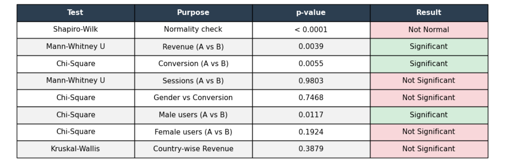

# 🛒 E-Commerce A/B Test Analysis
A comprehensive statistical analysis to evaluate whether a new website design (**Group B**) outperforms the original version (**Group A**) across conversion rate, revenue, and user behavior metrics.

## 📌 Project Overview
This project applies statistical methods to determine whether the differences observed between the control group (Group A) and the test group (Group B) are statistically significant or simply due to random chance.

## 📊 Dataset Summary
| Property | Details |
| :--- | :--- |
| **Total Users** | 8,000 |
| **Group A (Control)** | 3,980 users |
| **Group B (Test)** | 4,020 users |
| **Total Conversions** | 686 (8.6%) |
| **Countries** | Azerbaijan, Turkey, UK, Germany, Other |

## 🔍 Analysis Workflow
1. **Data Exploration** — Descriptive statistics and group balance.
2. **Data Visualization** — Conversion rates, revenue, and device breakdown.
3. **Statistical Testing** — Normality checks (Shapiro-Wilk) + hypothesis tests.
4. **Segmentation** — Gender and country-based breakdowns.

## 📈 Key Results & Statistics

### ✅ Conversion Rate (Chi-Square Test)
- **Group A:** 7.69% | **Group B:** 9.45%
- **p-value:** `0.0055` → **Statistically Significant.**
- *Insight:* Group B showed a meaningfully higher conversion rate.

### ✅ Revenue (Mann-Whitney U Test)
- **Group A ARPU:** $3.01 | **Group B ARPU:** $3.68
- **p-value:** `0.0038` → **Statistically Significant.**
- *Insight:* Group B generated significantly higher revenue per user.

### ✅ Pages Viewed (Mann-Whitney U Test)
- **p-value:** `< 0.05` → **Statistically Significant.**
- *Insight:* Group B users explored significantly more pages — the new design encouraged deeper site engagement.

### ❌ Sessions (Mann-Whitney U Test)
- **p-value:** `0.9803` → **Not Statistically Significant.**
- *Insight:* No meaningful difference in session frequency between groups.

### ❌ Gender vs Conversion (Chi-Square Test)
- **p-value:** `0.7468` → **Not Statistically Significant.**
- *Insight:* Overall conversion rates did not differ meaningfully between male and female users.

### ❌ Country-wise Revenue (Kruskal-Wallis Test)
- **p-value:** `0.3879` → **Not Statistically Significant.**
- *Insight:* No significant difference in revenue across countries was detected.
- 
## 🎯 Gender Segmentation (Crucial Discovery)
- **Male users:** `p-value: 0.011` → **Significant ✅**
- **Female users:** `p-value: 0.192` → **Not Significant ❌**
- *Insight:* The new design resonates strongly with male users, but hasn't impacted females yet.

## 💡 Business Recommendations
- **Targeted Rollout:** Deploy the new design primarily for male-dominant segments.
- **UX Iteration:** Further research is needed to understand why the design didn't lift female conversion.
- **Regional Strategy:** Focus marketing spend on high-revenue regions identified in the Kruskal-Wallis test.

## ✅ Final Conclusion
Group B showed statistically significant improvements in conversion, revenue, and page engagement. However, the effect was not uniform — strongest among male users, with no significant lift for female users. A targeted rollout is recommended before full-scale deployment.

## 🛠️ Tech Stack
- **Language:** Python
- **Libraries:** Pandas, NumPy, Matplotlib, Seaborn
- **Stats:** SciPy (Chi-Square, Mann-Whitney U, Kruskal-Wallis, Shapiro-Wilk)
- **Environment:** Google Colab

---
**Author:** Aytan Abdulhuseynova | [GitHub Profile](https://github.com/AytanAbdulhuseynova)
